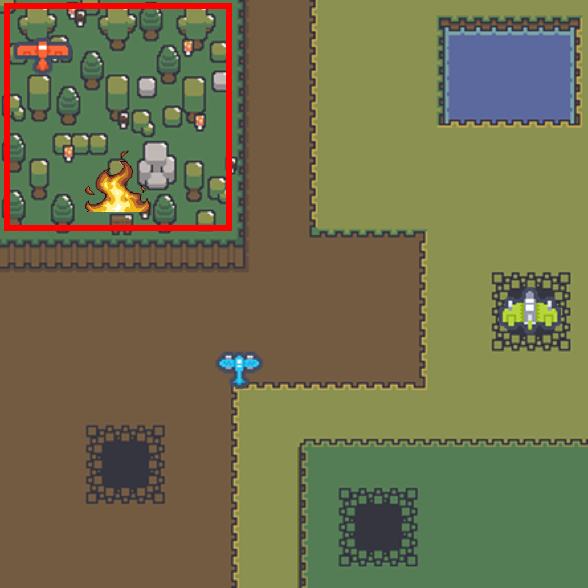

# FOS Simulator
##### Fire Operation Simulation


### 1. How to Run FOS Simulator
There are two methods for operating the FOS simulator: running on a `desktop` and using a `browser`.
###### 1-1. `Runnign on your Desktop`
> `!!Disclamer and Warning!!` Please note that downloading FOS binaries on DoDIN devices, such as NIPRNET Computers, is strictly prohibited. According to the Army IT User Agreement (AUP), downloading or running any executable files on government devices without proper authorization from the AO is not allowed.

To run the FOS simulator on your desktop:

* Download the appropriate Binary/Executable FOS Simulator file for your operating system from the
`Commercial`
[FOS Repository Release Tab](https://github.com/usfk-code-challenge-2023/FOS/releases), or
`DoD OneDrive`
[Digital O-Plan Sharepoint](https://armyeitaas.sharepoint-mil.us/:f:/t/DigitalO-Plan/EnqjykZrxFJOiZWOVMpqIeEBrrfoFucv0IEQZlKifhW9vw?e=qY7U0h) (requires CAC login).
* Execute the downloaded executable file with command line arguments. If the arguments are not specified, the program will attempt to receive required entries that have not been entered into the CLI interface since it was executed.

Example:

  <pre>./"FOS Simulator" --host 127.0.0.1 --port 8080</pre>
  ```python
  for index, arg in enumerate(argv):
        if arg == "help" or arg == "-help" or arg == "-h" or arg == "--help":
            print("""Usage:
            --help : to list all available
            --host [IP Address, Str] : host to connect to
            --port [Port, Int] : port to connect to
            --visualize [0/1] : visualize or not
            --logging [0/1] : enable log printing using stdout or not
            """)
            sys.exit(0)

        match (arg.startswith("--"), arg):
            case True, "--host":
                result["host"] = argv[index + 1]
            case True, "--port":
                result["port"] = int(argv[index + 1])
            case True, "--visualize":
                result["visualize"] = bool(int(argv[index + 1]))
            case True, "--logging":
                result["logging"] = bool(int(argv[index + 1]))
  ```
* The simulation log file will be automatically stored in the same directory as the simulator, named play_log.json.

###### 1-2. `Running on the Browser`

To run the FOS simulator on your browser:
* Download and save the FOS Simulator HTML and WASM related files in one directory from the listed release repository. Open index.html with your browser.
  > If you use the file:// protocol when running index.html, you may need to adjust your browser's CORS settings to enable the loading of WASM files.
  > <pre>C:\"Program Files (x86)"\Microsoft\Edge\Application\msedge.exe --disable-web-security --user-data-dir="C:\Users\_YOUR_USER_NAME__\Desktop\FOSWEB"</pre>
  > or
  > 
  > Reference this: https://answers.microsoft.com/en-us/microsoftedge/forum/all/disable-cors/55c89fb6-8d72-4318-9ee3-e9cdfc6fa708.
  > 
  > Alternatively, implement a web server to access index.html using the http:// protocol instead of the file:// protocol. You can also visit our example website for FOS Simulation at https://usfk-code-challenge-2023.github.io/FOS.
  
* Enter the address of the controller server to which the simulator will connect.
  
  > [Avaliable also on NIPR] Example Websocket Controller Server: (host) port-0-fos-cu6q2blkog9b7j.sel4.cloudtype.app  (port) 443
  
  > [Not Avaliable on NIPR] Example WebRTC Controller: Open [WebRTC Controller Example](https://usfk-code-challenge-2023.github.io/FOS/rtc_controller.html) as well as FOS Simulator on your browser and when Simulator asks you about host name, then type 'rtc'.
  
  > The simulator operates using WebAssembly on your local machine, rather than on a remote server. Even if you are targeting to run FOS simulator with your browser, you can connect to a locally hosted server(FOS Controller). The browser implementation primarily caters to individuals working on DoDIN computers. If you need to work within a browser, you can implement a local TCP server for the controller or use an external server to establish a connection.

* After completing the simulation, remember to download your play log file from your browser.

###### 1-3. `Detailed Description`
* For more comprehensive information on how to use the simulator and for additional details, please visit https://usfk-code-challenge-2023.github.io/FOS/Docs.

### 2. Implementing FOS Controller
* You can use either native TCP socket, WebSocket, or WebRTC to connect with this simulator.
* You can find a simple example of a controller at https://github.com/usfk-code-challenge-2023/FOS/blob/main/Docs/proto.ipynb (Native TCP Socket, Desktop) or https://github.com/usfk-code-challenge-2023/FOS/blob/main/Docs/proto(websocket).py (WebSocket, Browser or NodeJS)
* Turning off the visualization option in the FOS Simulator can be beneficial for AI/ML learning iterations.

### 3. Bug Report
* If you encounter any issues or bugs with the simulator, please contact SGT Kang, Kevin, USFK J5 AI/ML Planning Assistant, Digital O-Plan, via email at eun.kang.fm@army.mil or submit an issue report at https://github.com/usfk-code-challenge-2023/FOS/issues.

* Please make sure to regularly check the provided page for any additional simulator fixes that may have been implemented since the start of the competition.
